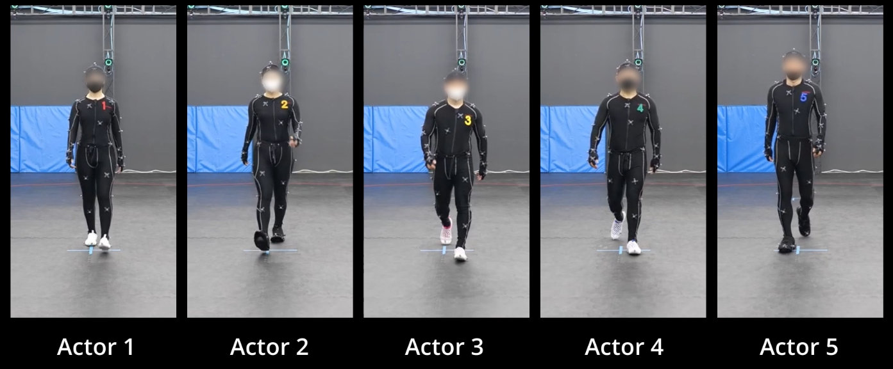

# PerMo (PersonaMotion) Dataset

PerMo is a dataset of human motion capturing unique personas from multiple actors, originally created as a benchmark for [PersonaBooth](https://boeun-kim.github.io/page-PersonaBooth/):

> **PersonaBooth: Personalized Text-to-Motion Generation**<br>
> Boeun Kim, Hea In Jeong, JungHoon Sung, Yihua Cheng, Jeongmin Lee, Ju Yong Chang, Sang-Il Choi, Younggeun Choi, Saim Shin, Jungho Kim, Hyung Jin Chang<br>
> https://arxiv.org/pdf/2503.07390

Five professional motion capture actors are hired and each actor is assigned to perform 34 styles, resulting in a total of 170 personas, 6610 clips. The dataset includes marker data, skeleton data, mesh data, rendered video, and text descriptions. Additional details on dataset can be found in the supplementary of our paper.

<p align="center">
    
</p>

## Overview

The dataset includes 34 styles and 10 contents. The contents are _Hop, Jump, Kick, Kick Something, Punch, Run, Throw, Transition, Walk, Wave_. The styles are as follows:

|Parent Category|Style Category|
|------|------|
|Age|Childish, Neutral, Old, Teenage|
|Character|Ballerina, Hulk, Monkey, Ninja, Penguin, Robot, SWAT, Waiter, Zombie|
|Condition|Arm-aching, Drunken, Exhausted, Head-aching, Healthy, Leg-aching, Text-necked|
|Emotion|Angry, Fearful, Happy, Sad, Strained, Surprising|
|Traits|Elegant, Shy, Silly, Uppity|
|Surroundings|Cold, Crowded, Muddy-floor, Unpleasant-floor|


Data is hosted on Google Drive:

|Data Type|File Name|Description|
|------|------|------|
|[Marker (C3D.zip)](https://drive.google.com/file/d/1UvD4zmLbTJzg2Z9s1f0RKzFLj8u71h6s/view?usp=drive_link)|[style]\_[content]\_[actor]\_[take].c3d|41 markers for each frame|
|[Skeleton (BVH.zip)](https://drive.google.com/file/d/12h_DJNRNFKu9z8b00dRKJ_3KSaFan7in/view?usp=drive_link)|[style]\_[content]\_[actor]\_[take].bvh|20 bones for each frame|
|[Mesh (SMPL-H.zip)](https://drive.google.com/file/d/1eJQpui51Kj2yFBy4_z3BiCQNKAgBByvN/view?usp=drive_link)|[style]\_[content]\_[actor]\_[take].npz|SMPL-H pose data|
|Mesh Shape<br/>(included in SMPL-H.zip)|shape_[style]\_[content]\_[actor].npz|SMPL-H shape data for each processing group|
|[Rendered Mesh (RENDERED.zip)](https://drive.google.com/file/d/1rKloOuZd8jrMvIJWbf842NPY6RHDjmRG/view?usp=drive_link)|[style]\_[content]\_[actor]\_001.mp4|Rendered video of the mesh data|
|[Text Description (PerMo_description.zip)](https://drive.google.com/file/d/1wMpTVbi7bKqa74SRYfMUyUNvasvHRNuU/view)|[content].txt|Text descriptions for each content type|

Marker data (C3D), Skeleton data (BVH), Mesh data (SMPL-H), Rendered video (RENDERED) have same data structure. The data structure is as follows:

<p align="center">
    
</p>


## Data Collection

The dataset is captured by five professional actors of diverse genders and body types, collected at the motion capture studio. Each actor was equipped with 41 optical markers during the recording process. From the marker data, skeleton information comprising 20 bones is generated and saved in BVH files using OptiTrack software. The optical marker data is converted into the standardized SMPL by MoSh++.

<p align="center">
    
</p>


## Data preprocess for PersonaBooth

1. Download the [Mesh file (SMPL-H.zip)](https://drive.google.com/file/d/1eJQpui51Kj2yFBy4_z3BiCQNKAgBByvN/view?usp=drive_link) from Google Drive and place it in the data folder.

2. The following command will unzip the file and chanage the folder structures required to run the PersonaBooth code.
    ```
    python preprocess_data.py --data_dir [Data Directory]
    ```
    

## Citation

Please cite the following paper if you use this data directly or indirectly in your research/projects:

```
@article{kim2025personabooth,
  title={PersonaBooth: Personalized Text-to-Motion Generation},
  author={Kim, Boeun and Jeong, Hea In and Sung, JungHoon and Cheng, Yihua and Lee, Jeongmin and Chang, Ju Yong and Choi, Sang-Il and Choi, Younggeun and Shin, Saim and Kim, Jungho and Chang, Hyung Jin},
  journal={arXiv preprint arXiv:2503.07390},
  year={2025}
}
```

## License

Software Copyright License for **non-commercial scientific research purposes**. Please read carefully the following [terms and conditions](./LICENSE.txt) and any accompanying documentation before you download and/or use the PerMo data and software, (the "Data & Software"). By downloading and/or using the Data & Software, you acknowledge that you have read these terms and conditions, understand them, and agree to be bound by them. If you do not agree with these terms and conditions, you must not download and/or use the Data & Software. Any infringement of the terms of this agreement will automatically terminate your rights under this License.
